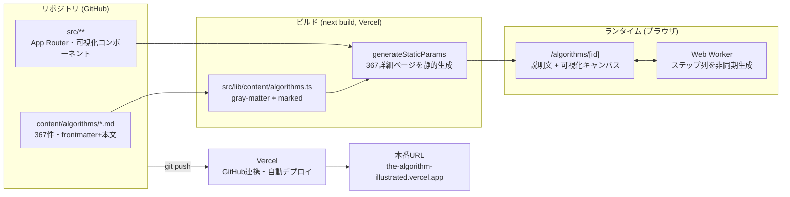
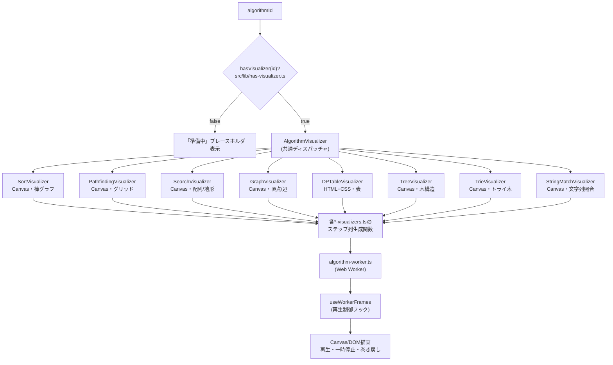
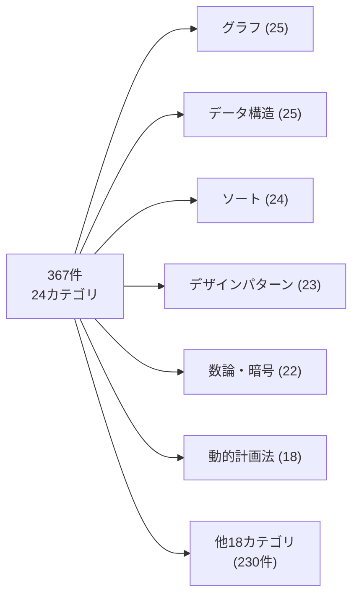
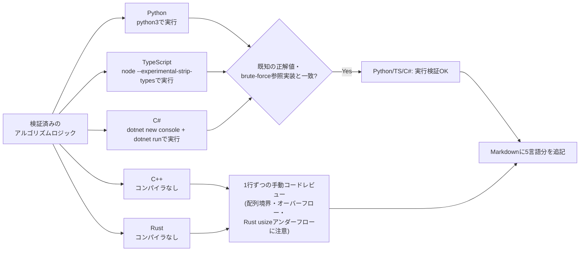
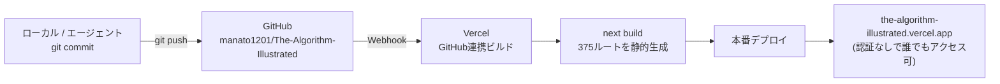

# アーキテクチャ図解

このドキュメントは、[docs/progress.md](progress.md)(実装の来歴を追う台帳)や[docs/technical-guide.md](technical-guide.md)(項目別の技術解説書)を補完する、**図解による全体像の把握**を目的としたドキュメントです。GitHub上で開くとMermaid記法の図がそのままレンダリングされます。

## 1. システム全体像

コンテンツ(Markdown)からブラウザ表示までの流れです。DB/CMSを持たず、リポジトリ内のMarkdownファイルを`next build`時にファイルシステム経由で読み込む構成が特徴です。



## 2. コンテンツパイプライン(1記事が表示されるまで)

各記事は `## 概要` `## 仕組み` `## 特性・トレードオフ` `## 実装例` の4見出し構成のMarkdown本文と、検索・分類に使うfrontmatterで構成されます。

```mermaid
sequenceDiagram
    participant FS as content/algorithms/bubble-sort.md
    participant GM as gray-matter
    participant MK as marked(カスタムrenderer)
    participant PAGE as /algorithms/[id]/page.tsx
    participant USER as ブラウザ

    FS->>GM: frontmatter + Markdown本文を読み込み
    GM-->>PAGE: { name, category, complexity, summary }
    PAGE->>MK: Markdown本文をHTML化
    Note over MK: コードフェンスを<br/>&lt;div class="codeBlock"&gt;に変換<br/>(言語ラベル付き)
    MK-->>PAGE: HTML文字列
    PAGE->>USER: SSGされた静的HTMLを配信
    USER->>USER: 可視化対応アルゴリズムなら<br/>Canvas/DOM描画エリアを表示
```

## 3. 可視化(ビジュアライザ)アーキテクチャ

可視化対応済み190件は、アルゴリズムの種類に応じて8種類のビジュアライザコンポーネントのいずれかにディスパッチされます。ステップ列の生成はUIをブロックしないようWeb Workerで行います。



## 4. カテゴリ分類(CATEGORY_TAXONOMY)

`category → subcategory[]` の2階層構造で、カタログ画面の絞り込みチップの元データになっています。367件は24カテゴリに分類され、件数の多い上位6カテゴリは以下の通りです(全カテゴリの一覧は[技術解説書](technical-guide.md#4-カテゴリ分類)を参照)。



## 5. 実装例(課題d)の検証フロー

各記事の`## 実装例`セクション(Python/TypeScript/C++/Rust/C#)は、言語ごとに異なる方法で正しさを検証しています(環境にC++/Rustのコンパイラがないという制約への対応)。



## 6. デプロイフロー



---

図の元データ・詳細な数値は[docs/technical-guide.md](technical-guide.md)、実装の来歴(いつ・何を・なぜ)は[docs/progress.md](progress.md)を参照してください。
